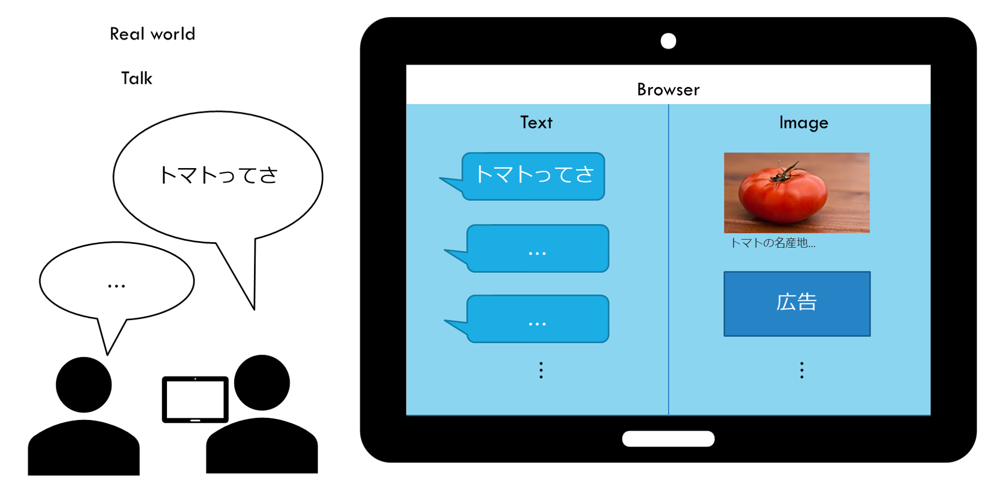

作りたいサービスの具現化に向けて情報収集する。サービス名は仮に"vistalk"と呼ぶことにする。

<!--more-->

## 作りたいサービス: vistalk（仮）

1. サービス（Webサイト）を立ち上げた状態で会話すると、
1. 会話が勝手にテキスト変換され、
1. キーフレーズに関連するリンクやECサイトの商品リンクが画像として表示される
1. ユーザーは、画像自体やリンクをたどって得た情報を得て、会話を深める

こんなイメージ

必要な機能をリスト化すると
- 音声認識
- キーワード抽出
- 画像検索

## 各種機能の実現方法を検討

### 音声認識

chromeだとWeb Speech APIを使えば実現可能。  
- [Webページでブラウザの音声認識機能を使おう - Web Speech API Speech Recognition](https://qiita.com/hmmrjn/items/4b77a86030ed0071f548)

これを使う

### キーワード抽出

技術的に簡単そうなのは形態素解析⇒固有名詞抽出？

Kuromoji.js
- [Kuromoji を使ってブラウザ上で形態素解析を行う (Reactあり/なし)](https://qiita.com/torao@github/items/45ad9640cf94d3169cae)
    > 意外にもクライアントサイドの JavaScript のみ行けました。
    - クライアントPCにkuromojiをインストールが必要
- [kuromoji.js demo](http://takuyaa.github.io/kuromoji.js/demo/tokenize.html)

開発用途なら無料のWeb API
- [Yahoo, テキスト解析Web API, 日本語形態素解析](https://developer.yahoo.co.jp/webapi/jlp/ma/v1/parse.html)

キーワードを抽出するならこちらがベター
- [Yahoo, テキスト解析Web API, キーフレーズ抽出](https://developer.yahoo.co.jp/webapi/jlp/keyphrase/v1/extract.html)

キーワードを直接抽出できそうな、Yahooのキーフレーズ抽出APIを使う

### 画像検索

##### 関連商品があれば広告を表示

ここで収益化。  
「キーフレーズ⇒商品検索⇒紹介リンク作成」が自動化できればいい。

楽天
- [楽天商品検索API](https://webservice.rakuten.co.jp/api/ichibaitemsearch/#requestURL): 「キーフレーズ⇒商品検索」ができそう
    > デベロッパーは、楽天商品検索APIから取得した商品情報からアフィリエイトURLを作成することが可能です。リンク先にそのアフィリエイトURLを指定することで、楽天アフィリエイト経由の成果報酬を獲得することができます。 
- [楽天アフィリエイト](https://affiliate.rakuten.co.jp/campaign/2020/rankup_g/?scid=af_g_202005): ここでも人力で同じような処理ができる

Amazon
- [Product Advertising API の概要](https://images-na.ssl-images-amazon.com/images/G/09/associates/paapi/dg/index.html)
    > よりすばらしいことに、Product Advertising API は無料でご利用いただけます。すでに数多くの Product Advertising API 利用者が、このサービスを利用したアプリケーションやオンラインストアを開発し、アソシエイトとしての報酬を手にしています。Amazon アソシエイト・プログラムメンバーへの登録と併せて、 Product Advertising API の利用登録を行うことで、誰でも Product Advertising API により作成されたアプリケーションや Web サイトを通じてアソシエイト報酬を獲得できます
- [Product Advertising API について](https://affiliate.amazon.co.jp/help/node/topic/GMEDADBTCJ9KD8DQ): amazonアソシエイト・プログラム登録には審査が必要

ゴールド会員になっている楽天の商品検索APIを使う

##### なければ画像検索結果を表示

有名どころのAPIは無料枠が限定的
- [無料で使える画像検索APIとリクエスト数制限まとめ](https://qiita.com/daisy1754/items/92943169cb3438b1879e)

Rakuten Rapid APIなら割安
- [Imgur](https://api.rakuten.net/imgur/api/imgur-9/pricing)

完全無料がいい。

完全無料でやるなら、サーバ使ってスクレイピング  
- [PythonでGoogle画像検索をして画像をフォルダに保存する](https://qiita.com/Yuki-Takatsu/items/3f30727d5b21a83ea4ed)

★できればgithub pagesで完結したい

